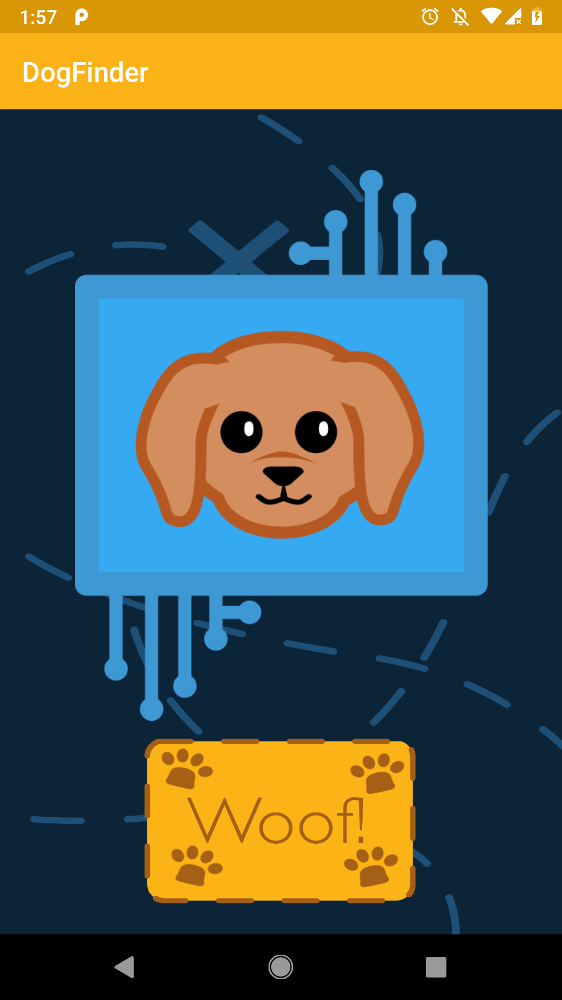
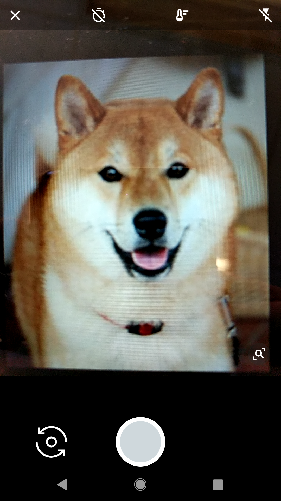
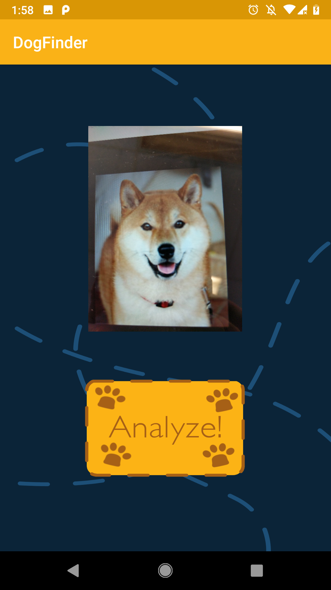
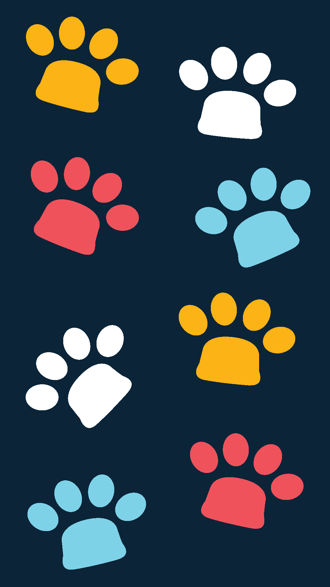
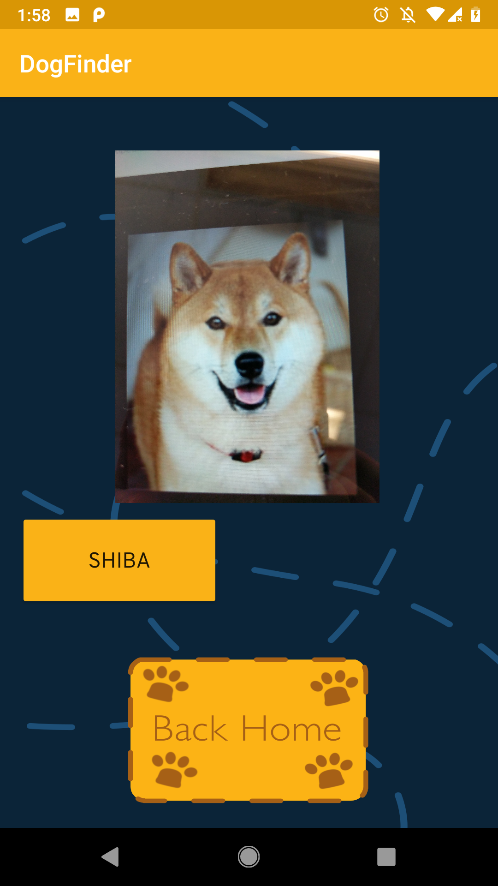

# Hacker-Puppies
Entry for McWics Hackathon 2019. Check out our DevPost submission [here](https://devpost.com/software/hacker-puppies)!

"What's That Woof?" is a dog breed identification Android app. The user uses it by taking a picture of a dog that will be analyzed by the app. The dog's breed is then returned.]

Below are screenshots of the app in action.

## Authors
Developed by [Rosie Zhao](https://github.com/rosieyzh), [Danny Xie](https://github.com/dnxie12) and [Zedian Xiao](https://github.com/zedian) of McGill University. 
